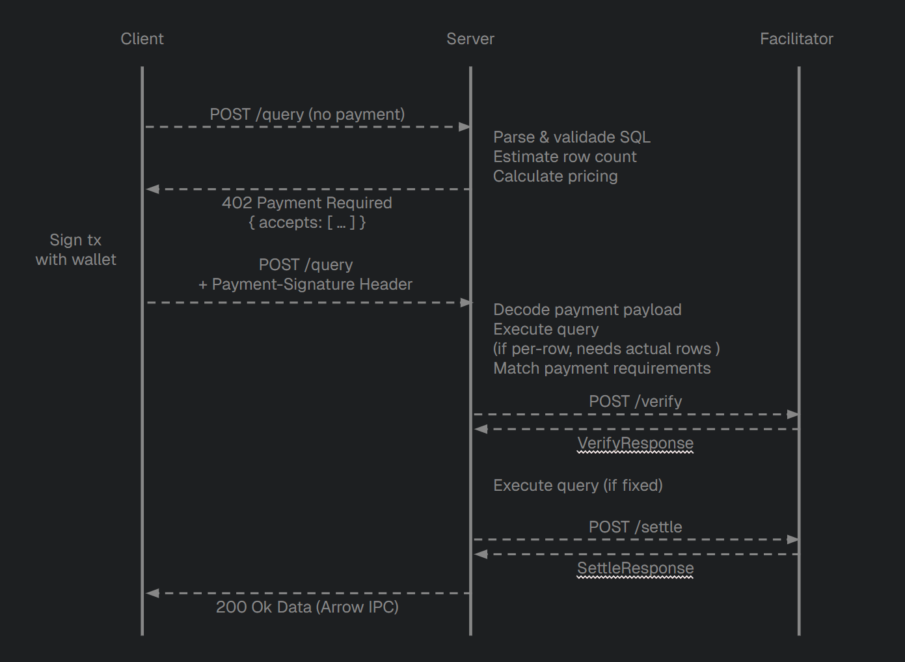

# Payment Flow

The server implements a two-step HTTP payment flow based on the [x402 protocol](https://www.x402.org/) (V2). The flow differs slightly depending on whether the table uses **per-row** or **fixed** pricing.

## Pricing Flow



## Step 1: Estimation

When a client sends a query without a `Payment-Signature` header:

1. The server parses and validates the SQL.
2. For **per-row** tables: it wraps the query in `SELECT COUNT(*) FROM (...)` to estimate the row count. It then calculates applicable pricing tiers based on the estimated row count.
   For **fixed-price** tables: this step is skipped (the price doesn't depend on row count).
3. It returns HTTP **402 Payment Required** with:
   - A JSON body containing the error message, resource info, and all applicable payment options.
   - A `Payment-Required` header with the same information, base64-encoded.

```json
{
  "x402Version": 2,
  "error": "No crypto payment found. Implement x402 protocol...",
  "resource": {
    "url": "http://server:4021/api/query",
    "description": "Uniswap v2 swaps - 2 rows",
    "mime_type": "application/vnd.apache.arrow.stream"
  },
  "accepts": [
    {
      "scheme": "exact",
      "network": "base-sepolia",
      "amount": "4000",
      "pay_to": "0xE7a820f9E05e4a456A7567B79e433cc64A058Ae7",
      "max_timeout_seconds": 300,
      "asset": "0x036CbD53842c5426634e7929541eC2318f3dCF7e",
      "extra": { "name": "USDC", "version": "2" }
    }
  ]
}
```

Each entry in `accepts` represents a valid payment option. If multiple pricing tiers apply (e.g., different tokens or bulk tiers), multiple options are returned.

## Step 2: Execution and Settlement

When the client resubmits with a `Payment-Signature` header (base64-encoded payment payload). THe process differs for each pricing model:

### Per-Row Tables

1. The server decodes and deserializes the payment payload into a V2 `PaymentPayload`.
2. It executes the actual query to get the real row count.
3. It matches the payload's `accepted` field against the generated payment requirements.
4. It sends a **verify** request to the facilitator to confirm the payment is valid and funded.
5. If verified, it sends a **settle** request to execute the on-chain transfer.
6. It returns the query results as Arrow IPC with HTTP 200.

### Fixed-Price Tables

1. The server decodes and deserializes the payment payload into a V2 `PaymentPayload`.
2. It matches the payload's `accepted` field against the generated payment requirements.
3. It sends a **verify** request to the facilitator to confirm the payment is valid and funded.
4. **Only after verification succeeds**, it executes the actual query.
5. It sends a **settle** request to execute the on-chain transfer.
6. It returns the query results as Arrow IPC with HTTP 200.

## Error Cases

| Scenario | Response |
|----------|----------|
| Table not found | 400 Bad Request |
| Invalid SQL | 400 Bad Request |
| Malformed payment header | 400 Bad Request |
| No matching payment offer | 500 Internal Server Error |
| Payment verification fails | 402 Payment Required (with reason and updated options) |
| Payment settlement fails | 402 Payment Required (with reason and updated options) |
| Facilitator unreachable | 500 Internal Server Error |
