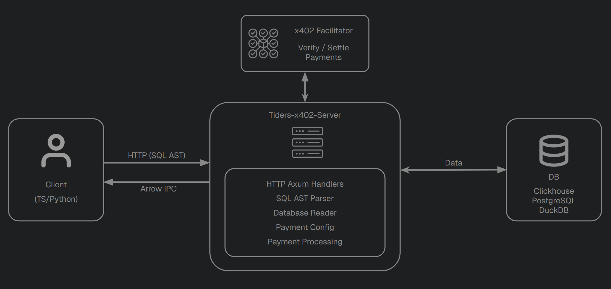

# Server Overview

## System Components

The server sits between clients and a database. Clients submit SQL queries over HTTP. If a table requires payment, the server processes the request, calculates the cost, and coordinates with an external x402 facilitator to verify and settle the payment before returning data as Arrow IPC.

You can run the server in two ways: via the [CLI](../cli/cli-overview.md) (YAML config, no code) or by embedding it as a [library](../sdk-library/sdk-building.md) (Rust or Python).

## Module Structure

The server is organized into the following modules:

| Module | Purpose |
|--------|---------|
| `root_handler` | `GET /` — returns server metadata and available tables |
| `query_handler` | `POST /query` — main handler for query execution and payment flow |
| `table_detail_handler` | `GET /table/:name` — returns table schema and payment offers, optionally paywalled |
| `sqp_parser` | Parses and validates SQL, rejecting unsafe operations |
| `sql_[database]` | Converts analyzed queries to Database-compatible SQL |
| `database` | Implement the database trait to execute queries, get schemas and serializes results to Arrow IPC |
| `price` | Pricing model: `PricingModel` (per-row or fixed), `PriceTag`, and `TablePaymentOffers` data structures |
| `payment_config` | Determines pricing for a query and generates x402 V2 payment requirements |
| `payment_processing` | Translates between V2 types and the facilitator's wire format |
| `facilitator_client` | HTTP client for the remote x402 facilitator |

## Request Lifecycle

1. **Axum** receives the HTTP request and routes it to the appropriate handler.
2. **sqp_parser** parses and validates the SQL (rejects unsafe operations).
3. **duckdb_reader** converts the analyzed query to a DuckDB-compatible SQL string.
4. **payment_config** determines whether the table is free or paid, and calculates pricing based on the estimated row count.
5. If payment is required, **payment_processing** and **facilitator_client** handle verification and settlement with the remote facilitator.
6. **database** executes the query and serializes results to Arrow IPC.
