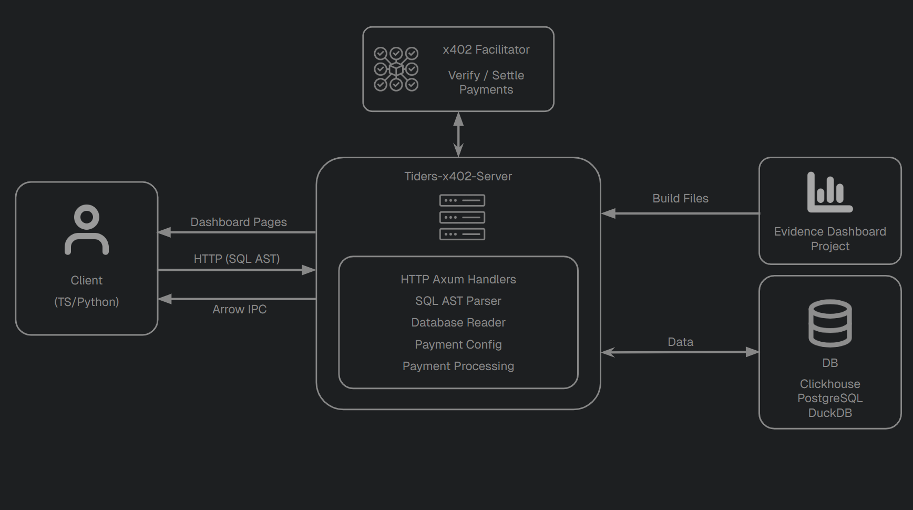

# Server Overview

## System Components

The server sits between clients and a database. Clients submit SQL queries over HTTP at `/api/query`. If a table requires payment, the server calculates the cost, returns an HTTP 402 with the payment options, and once the client resubmits with a signed payment, coordinates with an external x402 facilitator to verify and settle the payment before returning data as Arrow IPC.

The same binary also serves [Evidence](https://docs.evidence.dev/) dashboards static pages at the endpoint `/<slug>/`, and a landing page with links to the multiple dashboards. The CLI can scaffold dashboards via `tiders-x402-server dashboard <slug>` which you can later edit at will.

You can run the server in two ways: via the [CLI](../cli/cli-overview.md) (YAML config, no code) or by embedding it as a [library](../sdk-library/sdk-building.md) (Rust or Python).

## Module Structure

The server is organized into the following modules under `server/src/`:

| Module | Purpose |
|--------|---------|
| `lib.rs` | Server bootstrap: builds the Axum router, mounts API + dashboard routes, installs tracing/OTLP, handles graceful shutdown |
| `handler_api_root.rs` | `GET /api/` — JSON discovery document with server info, endpoints, and per-table summaries |
| `handler_api_query.rs` | `POST /api/query` — main handler for query execution and the x402 payment flow |
| `handler_api_table_detail.rs` | `GET /api/table/{name}` — table schema and payment offers |
| `cli/` | YAML config types (`config.rs`), YAML file loader and validation, env-var expansion and file watcher |
| `dashboard/` | Dashboard config (`config.rs`), Axum sub-router (`routes.rs`), scaffolder (`scaffold.rs`), embedded Evidence templates (`templates.rs` + `templates/`) |
| `database/` | `Database` trait + per-backend impls (`db_duckdb.rs`, `db_postgresql.rs`, `db_clickhouse.rs`), the simplified SQL parser (`sql_parser.rs`), and per-backend SQL read functions (`sql_*.rs`) |
| `payment/` | `price.rs` (`PricingModel`, `PriceTag`, `TablePaymentOffers`), `config.rs` (`GlobalPaymentConfig`, payment requirements), `processing.rs` (verify/settle orchestration), `facilitator_client.rs` (HTTP client for the facilitator) |

## Request Lifecycle

For a paid query against `POST /api/query`:

1. **Axum** receives the HTTP request, the routing layer matches `/api/*` to the API sub-router; everything else falls through to the dashboard sub-router.
2. **`sql_parser`** parses the SQL string and rejects unsafe constructs.
3. **Per-backend `sql_*.rs`** converts the analyzed query into backend-specific SQL.
4. **`payment_config`** determines whether the table is free, paid, or unknown, and (for per-row pricing) computes pricing tiers based on an estimated row count.
5. If payment is required, **`payment_processing`** and **`facilitator_client`** handle verification and settlement with the remote facilitator. Fixed-price tables verify *before* executing; per-row tables execute first to compute the actual row count.
6. **Database** executes the query and serializes results into the Arrow IPC streaming format.

## Hot Reload

When started via `tiders-x402-server start` (without `--no-watch`), a `notify`-backed watcher tracks the YAML config file. On change, the server re-parses the config and atomically swaps in a new `GlobalPaymentConfig` and dashboard router via `arc-swap`. Tables, pricing, facilitator settings.

## Observability

The server emits structured logs via `tracing` and, when `OTEL_EXPORTER_OTLP_ENDPOINT` is set, exports OpenTelemetry spans over OTLP/gRPC. Each `POST /api/query` request gets its own `api_query` span; facilitator calls (`/verify`, `/settle`) are wrapped in their own spans with success/error status. The service name defaults to `tiders-x402` and can be overridden with `OTEL_SERVICE_NAME`.
